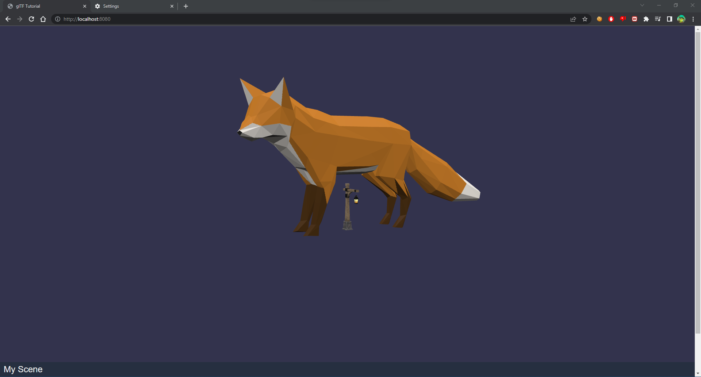

# GLTF Tutorial Project
- Using Babylon.js Engine



## How to run
```bash
npm install
npm install babylonjs babylonjs-loaders --force  
npm run start
```
- visit: http://localhost:8080

## Reference
- Links: https://docs.aws.amazon.com/sumerian/latest/tutorials/gltf-viewer.html
